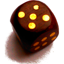

 Shut the Box
============

* <em>Start an online</em> <b>Shut the Box</b> <em>session on</em> http://omerkel.github.io/Shut-the-Box/html5/src/
* <em>runs in various browsers on</em>
    * <em>desktop systems like BSDs, Linux, Win, MacOS and</em>
    * <em>mobile platforms like Android, FirefoxOS, iOS.</em>

<b>Keywords, Categories</b> <em>Dice Game, Games/Entertainment, Mobile</em>

This is the famous traditional pub game Shut the Box. It is implemented for HTML5/Javascript/CSS platforms.

Shut the Box is played in different variants and no organization is known
targeting standardization of rule variants for the game. Thus if
playing <em>Shut the Box</em> with others you should first try
to find agreement and commitment on rules. If in doubt I recommend
to prefer and apply the locally played rules.

The Shut the Box application is intended to be less restrictive.
Such that no specific rules are really forced to be applied. At any
time you can take back an action like open a just closed flap and
perform a different choice. If in need you can use a single die
or two dice, roll again, switch to the menu and look up any rule
variants in between game play.

### Contributors / Authors

<table>
  <tr>
    <td>
Oliver Merkel,  This image is licensed under a <a rel="license" href="http://creativecommons.org/licenses/by-nc-nd/4.0/">Creative Commons Attribution-NonCommercial-NoDerivatives 4.0 International License</a>.    
    

    </td>
    <td width="50%"></td>
  </tr>
</table>

_All logos, brands, and trademarks mentioned belong to their respective owners._
