# Shut the Box Software Architecture

## 1. Purpose and Scope

This document defines a maintainable, testable, and evolvable software architecture for the Shut the Box application.

Scope:

- HTML5/PWA web client in [html5/src](../html5/src)
- Offline behavior and installability through service worker and manifest
- Runtime internationalization strategy with locale dictionary
- Supported languages: English, Deutsch, Italiano, Français, Español
- Audio subsystem for dice roll sound
- Testability and quality controls using Vitest and coverage thresholds

The architecture intentionally stays lightweight (static-host friendly, no backend required) while introducing strict modular boundaries and clear evolution paths.

## 2. Architectural Drivers

### 2.1 Functional Drivers

- Play Shut the Box interactively with two dice or optional single-die mode
- Open/close flaps and reset game state
- Switch language between English, Deutsch, Italiano, Français, and Español
- Select dice sound intensity (off, soft, normal)
- Run installable PWA and support offline execution

### 2.2 Quality Attributes

- Maintainability: clear boundaries between UI orchestration and pure logic
- Testability: deterministic pure functions with high branch coverage
- Portability: browser-first, mobile-friendly, static hosting compatible
- Performance: low startup cost, cache-first static assets
- Reliability: graceful degradation if service worker or audio cannot initialize
- Accessibility: keyboard-accessible tabs and accordion behavior

### 2.3 Constraints

- No jQuery / jQuery UI dependency
- ES modules in browser
- Static assets only (no runtime backend)
- App version line in deployable metadata

## 3. Architectural Style

Primary style: Layered client-side architecture with modular ES module boundaries.

Secondary styles:

- Event-driven UI orchestration (DOM events)
- Functional core / imperative shell pattern
  - Functional core: pure logic in [html5/src/js/hmi-helpers.js](../html5/src/js/hmi-helpers.js)
  - Imperative shell: side-effect orchestration in [html5/src/js/hmi.js](../html5/src/js/hmi.js)
- Offline-first delivery pattern using cache storage in [html5/src/sw.js](../html5/src/sw.js)

## 4. System Context

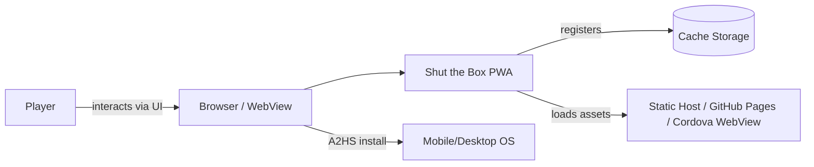

## 5. Container and Component View

### 5.1 Container View

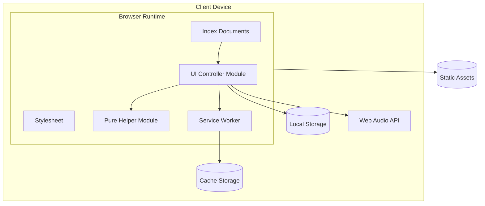

### 5.2 Internal Component Responsibilities

- UI Controller ([html5/src/js/hmi.js](../html5/src/js/hmi.js))
  - DOM binding and lifecycle initialization
  - Tab and accordion behavior
  - Dice rendering and game interaction events
  - Sound options persistence
  - Service worker registration
- Helper Module ([html5/src/js/hmi-helpers.js](../html5/src/js/hmi-helpers.js))
  - Sound level validation and normalization
  - Gain/envelope/modulation math
  - Dice value computation and clamping
- Service Worker ([html5/src/sw.js](../html5/src/sw.js))
  - Precache installation assets
  - Cache version rotation
  - Navigation fallback and cache-first strategy for static resources

## 6. Domain Model

The game uses a compact in-memory state:

- Dice: die1 and die2 image bindings
- Flaps: 9 checkbox-backed toggles
- Mode: single-die toggle
- Sound settings: off/soft/normal persisted in local storage

No remote persistence exists by design.

## 7. Data and State Management

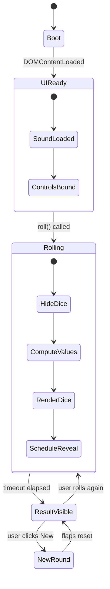

## 8. Detailed UML Views (Full Typical Range)

The following section intentionally covers the full range of typical UML diagram categories used in software architecture. Where Mermaid does not provide a dedicated UML dialect for a specific diagram type, an equivalent notation is used.

### 8.1 Use Case Diagram

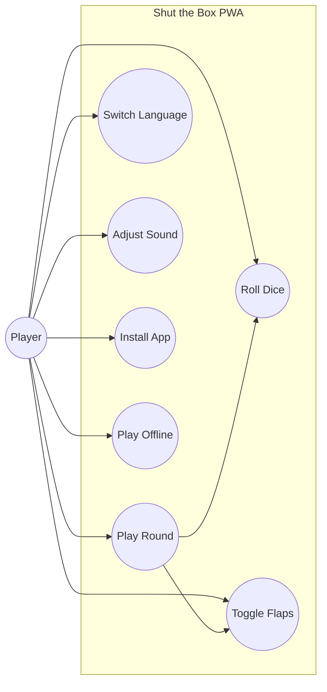

### 8.2 Class Diagram

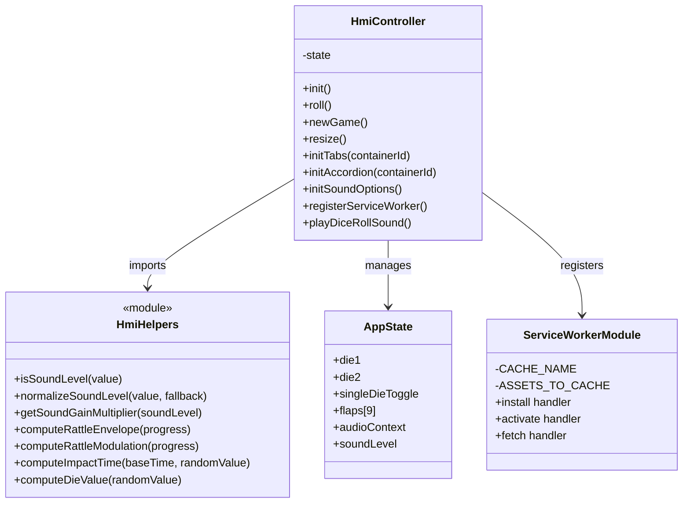

### 8.3 Object Diagram

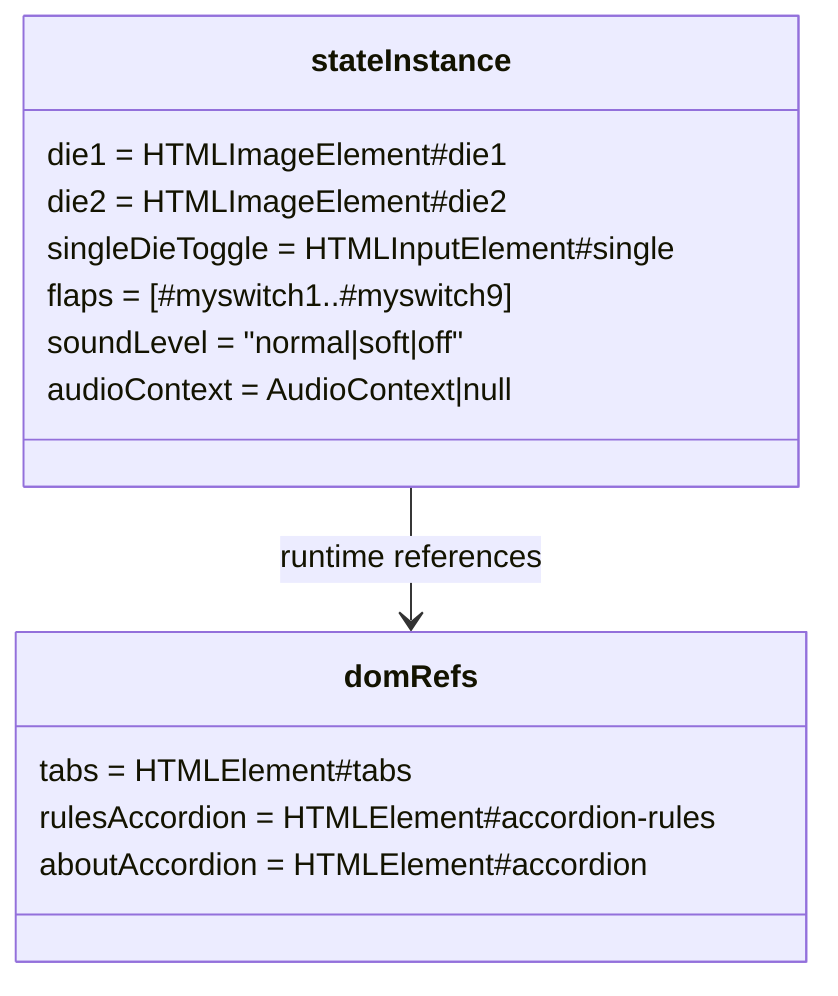

### 8.4 Package Diagram

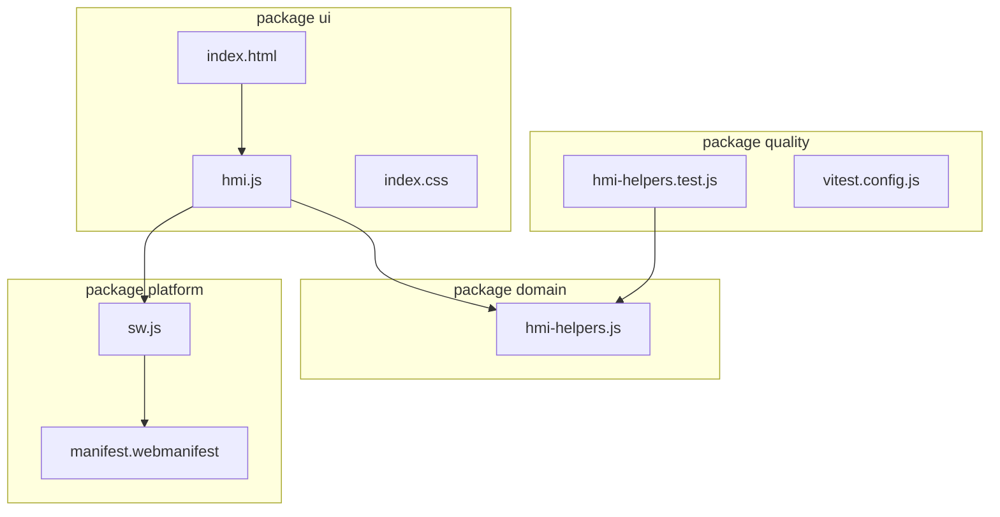

### 8.5 Component Diagram

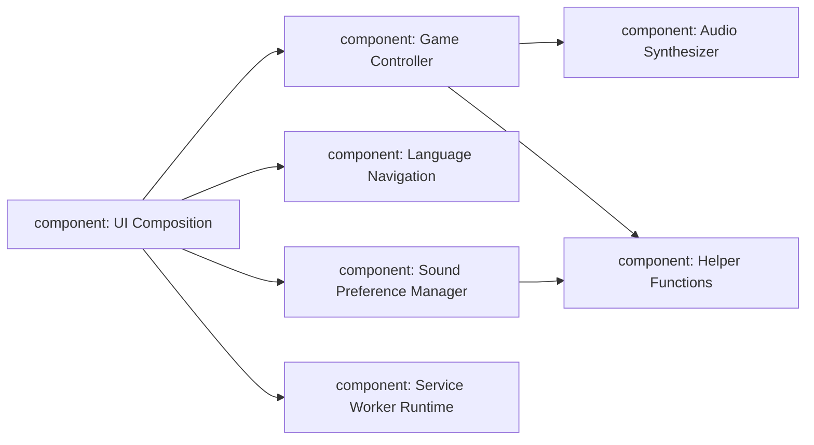

### 8.6 Composite Structure Diagram (Equivalent)

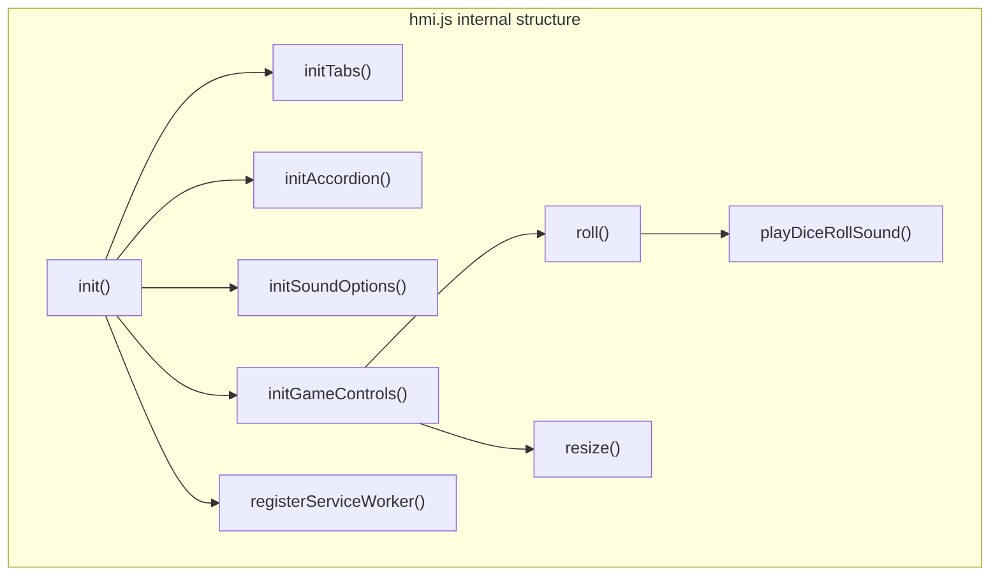

### 8.7 Deployment Diagram

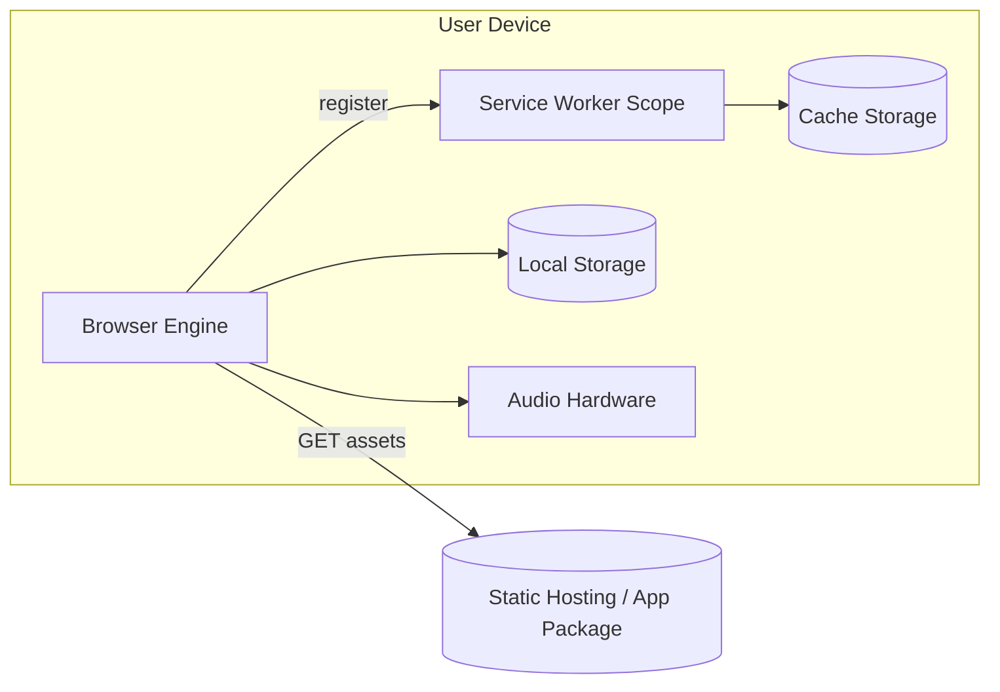

### 8.8 Profile Diagram (Lightweight)

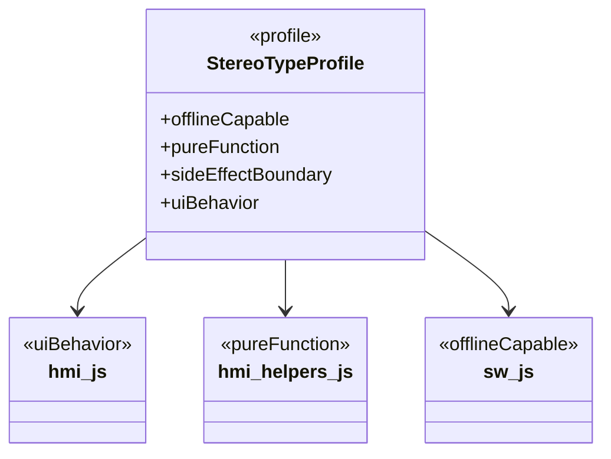

### 8.9 Activity Diagram

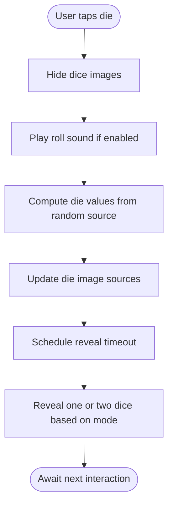

### 8.10 State Machine Diagram

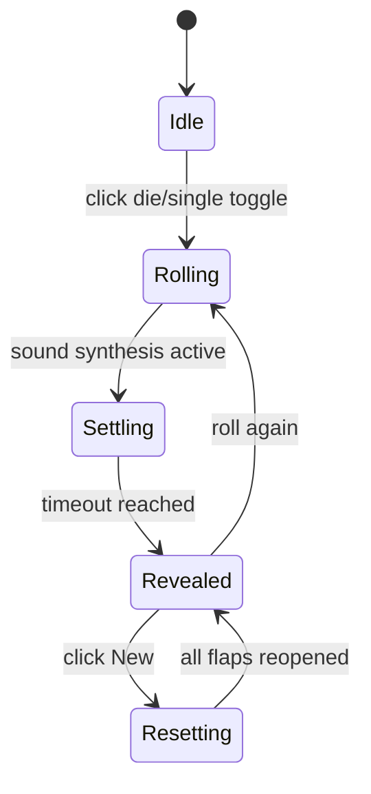

### 8.11 Sequence Diagram

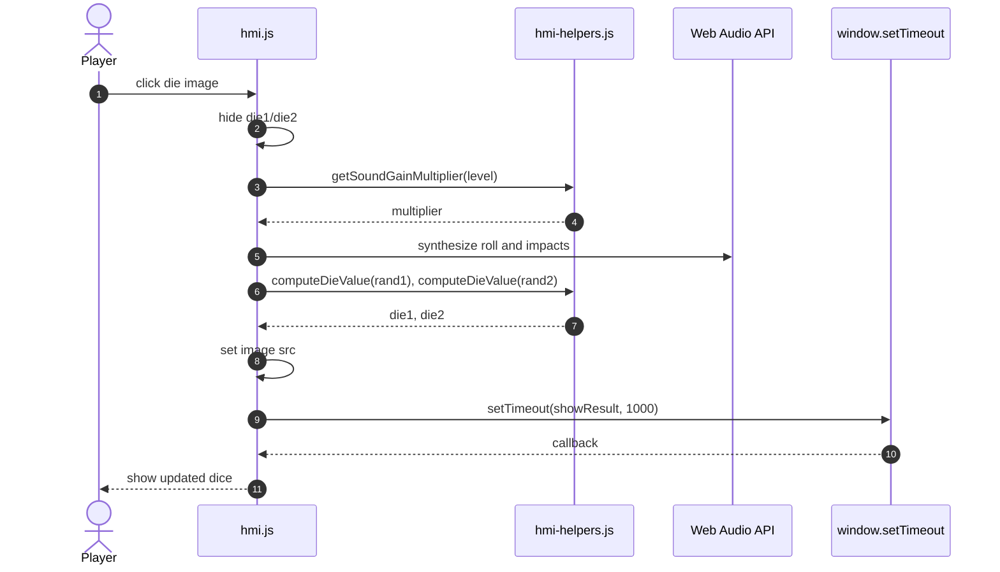

### 8.12 Communication Diagram (Equivalent)

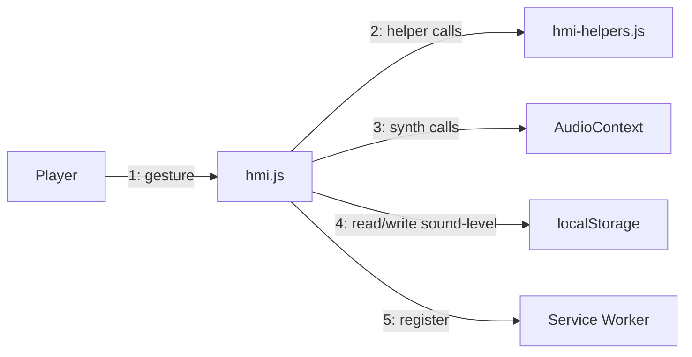

### 8.13 Interaction Overview Diagram (Equivalent)

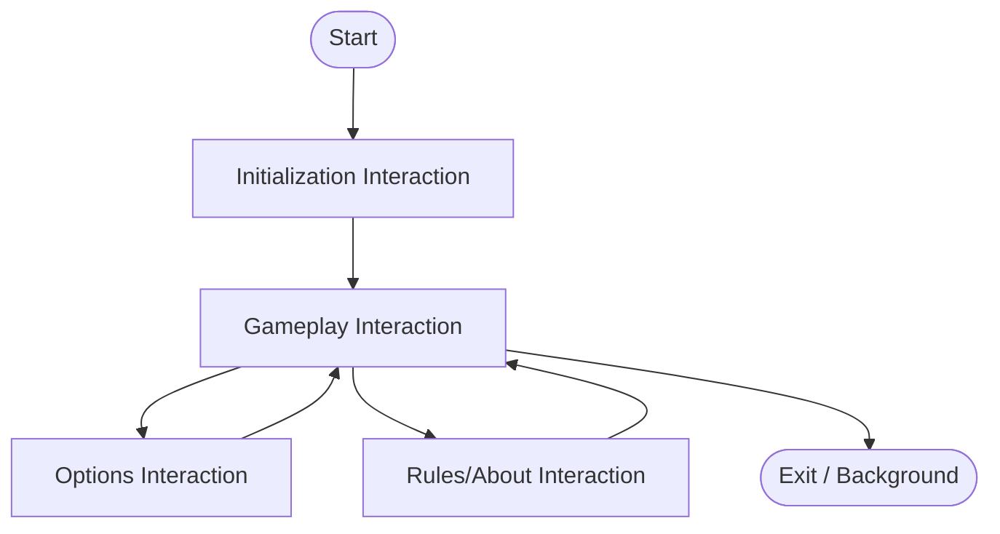

### 8.14 Timing Diagram (Equivalent)

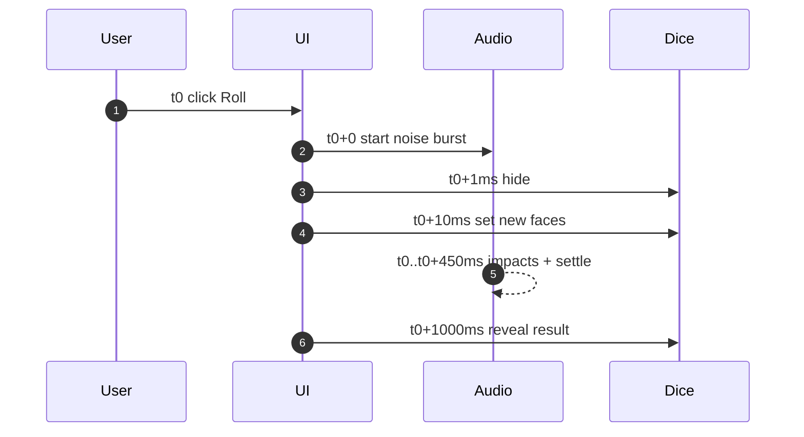

## 9. Interface Contracts

### 9.1 hmi-helpers.js Public API

- SOUND_LEVEL_STORAGE_KEY: local storage key for sound preference
- SOUND_LEVEL: enum-like object with OFF, SOFT, NORMAL
- isSoundLevel(value): strict validator
- normalizeSoundLevel(value, fallback): input sanitizer
- getSoundGainMultiplier(soundLevel): maps preference to gain scalar
- computeRattleEnvelope(progress): deterministic decay curve
- computeRattleModulation(progress): deterministic modulation curve
- computeImpactTime(baseTime, randomValue): timing helper
- computeDieValue(randomValue): safe conversion to die face [1..6]

Contract rules:

- Pure functions must not access DOM, storage, audio, or global mutable state
- Invalid or non-finite inputs return safe defaults rather than throwing

### 9.2 Service Worker Contract

- Install event precaches baseline assets required for first offline startup
- Activate event deletes stale cache versions
- Fetch event handles:
  - navigation requests with network-first and offline fallback
  - static GET resources with cache-first + runtime cache fill

## 10. Cross-Cutting Concerns

### 10.1 Internationalization

- Current implementation uses a single entry page with runtime locale binding:
  - [html5/src/index.html](../html5/src/index.html)
  - [html5/src/js/locale-dictionary.js](../html5/src/js/locale-dictionary.js)
- Option menu provides runtime language selection

Recommended evolution:

- Locale dictionary module and runtime text binding are implemented in production.

### 10.2 Accessibility

- ARIA-managed tabs and tabpanels
- Keyboard support for tab navigation and accordion toggling
- Image alt texts for dice and decorative content

### 10.3 Resilience

- Audio failures are non-fatal
- Service worker registration failures are non-fatal
- Offline fallback route available for navigation requests

## 11. Security and Privacy Considerations

- No server-side personal data handling
- localStorage only stores non-sensitive setting value for sound level
- Same-origin restriction in service worker fetch handling
- Recommended hardening:
  - strict Content Security Policy in hosting environment
  - Subresource Integrity if external assets are introduced later

## 12. Testing and Quality Strategy

Current quality controls:

- Unit tests at [html5/src/test/hmi-helpers.test.js](../html5/src/test/hmi-helpers.test.js)
- Coverage policy at [html5/vitest.config.js](../html5/vitest.config.js)
  - statements, branches, functions, lines >= 95%
- Non-watch CI-ready script in [html5/package.json](../html5/package.json)

Test architecture principle:

- Keep deterministic logic in pure module boundaries so it can be tested without DOM or browser mocks.

Recommended additions:

- UI interaction tests using a browser automation harness (Playwright)
- Service worker behavior tests with controlled fetch mocks
- Lint gate for markdown and JavaScript in CI

## 13. Build and Delivery Architecture

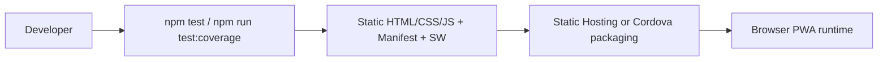

## 14. Decision Records (ADR Summary)

Formal ADRs:

- [doc/adr/ADR-001-remove-jquery.md](adr/ADR-001-remove-jquery.md)
- [doc/adr/ADR-002-es-modules-and-helper-extraction.md](adr/ADR-002-es-modules-and-helper-extraction.md)
- [doc/adr/ADR-003-service-worker-module-and-cache-manifest.md](adr/ADR-003-service-worker-module-and-cache-manifest.md)
- [doc/adr/ADR-004-runtime-i18n-single-entry.md](adr/ADR-004-runtime-i18n-single-entry.md)

## 15. Evolution Roadmap Toward Superior Architecture

Phase A: Domain Extraction

- Introduce dedicated game-engine module for rule evaluation and scoring
- Keep hmi.js as presentation controller only

Phase B: Localization Abstraction

- Add translation catalogs and key-based rendering
- Extend localization coverage and automate translation quality checks

Phase C: Offline Robustness

- Move to generated revisioned precache manifest
- Add stale-while-revalidate strategy for selected static assets

Phase D: Observability and Validation

- Add lightweight telemetry hooks for error paths (opt-in)
- Add integration tests for service worker lifecycle

## 16. Architecture Compliance Checklist

- UI orchestration must remain side-effect boundary only
- Pure logic must remain in standalone importable modules
- New features require at least one UML view update in this document
- PWA changes must update cache asset list and version strategy
- New settings must have persistence contract and tests
- Coverage thresholds must remain >= 95% for included modules
